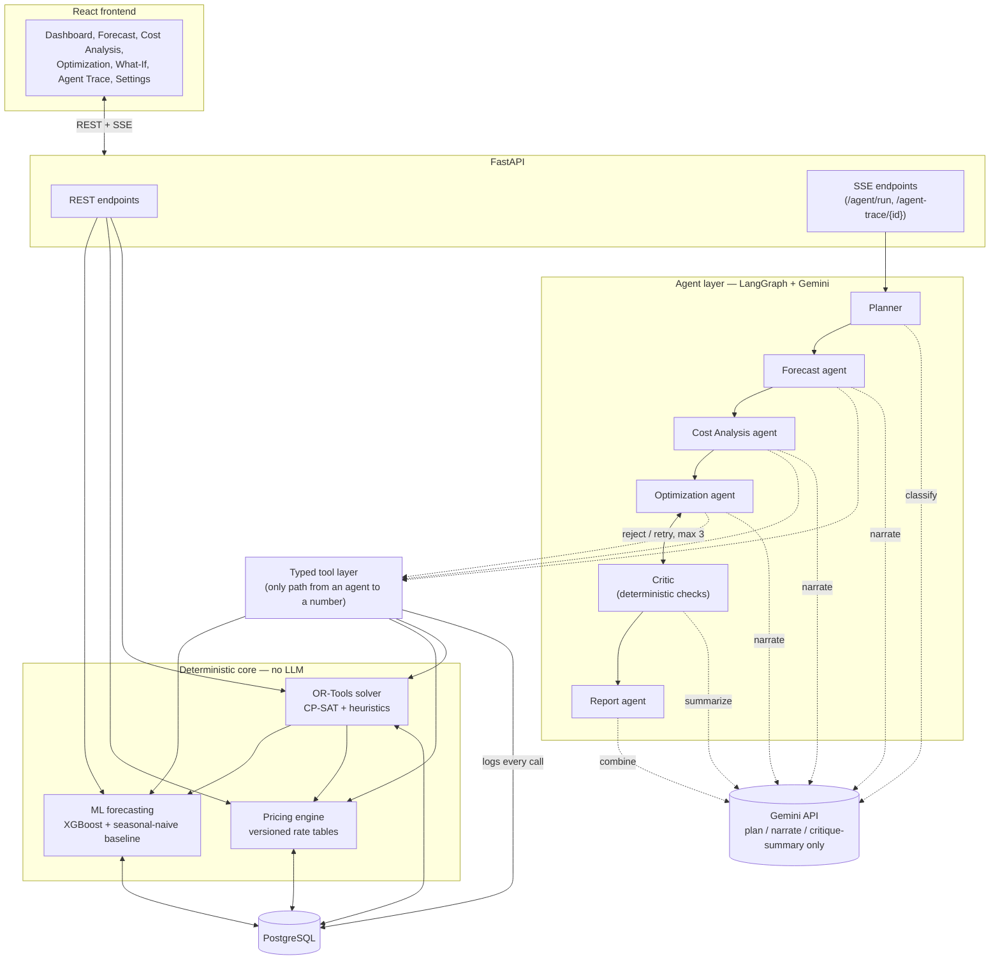
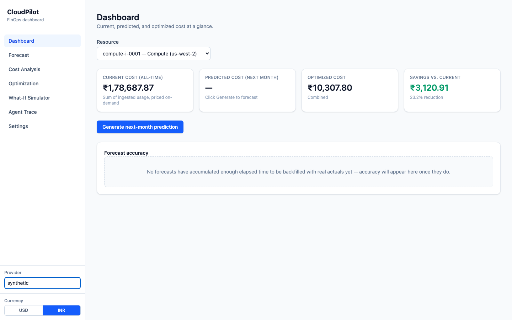
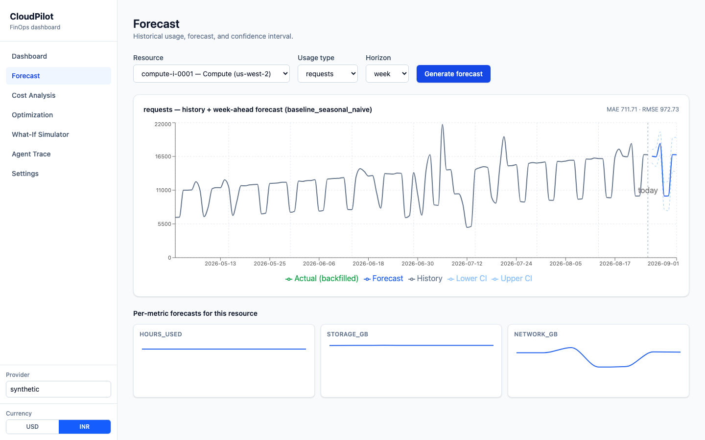
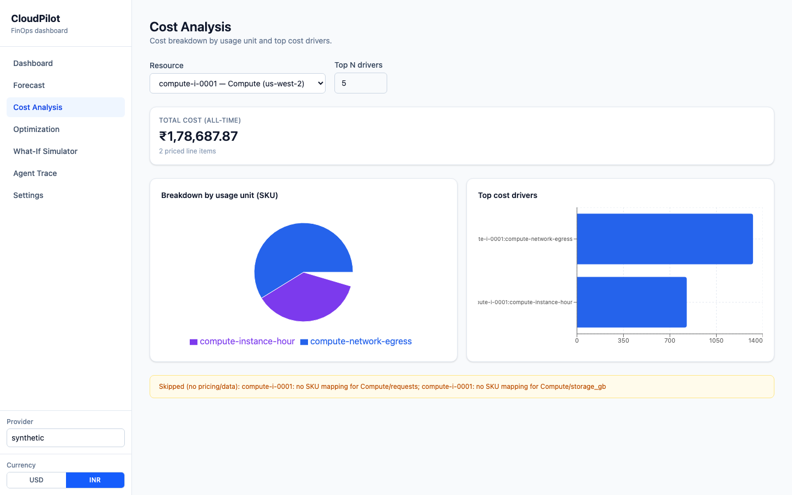
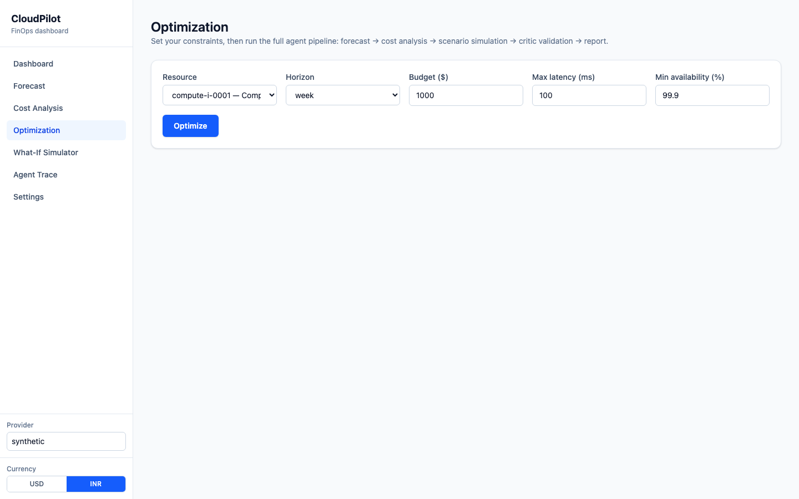
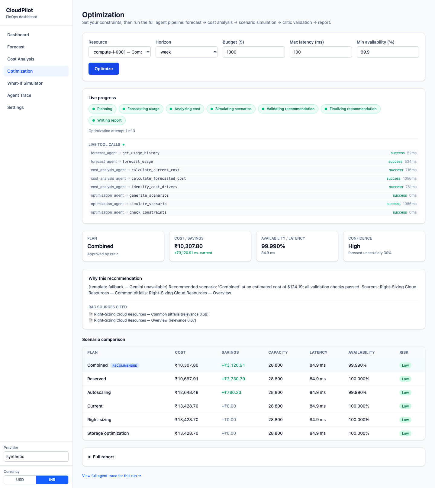
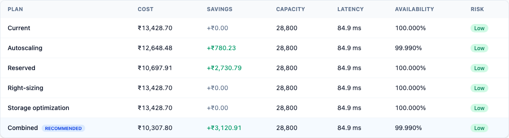
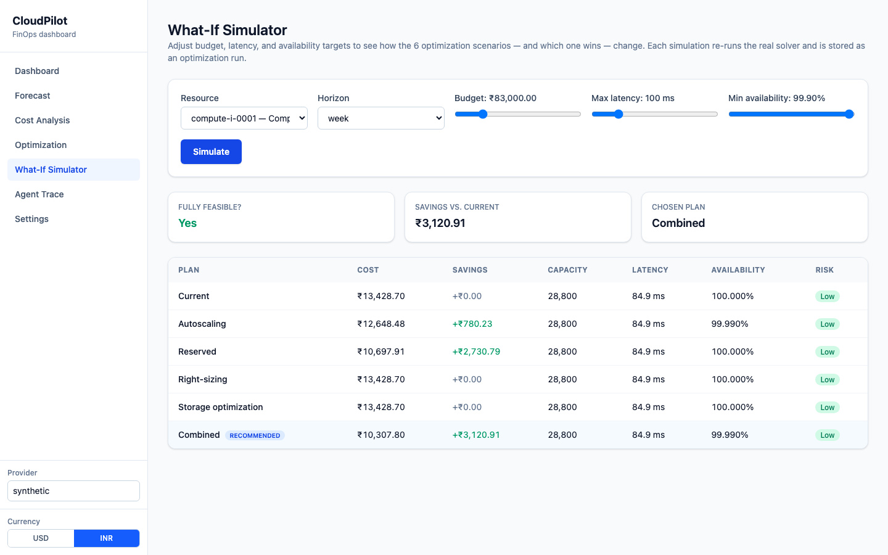
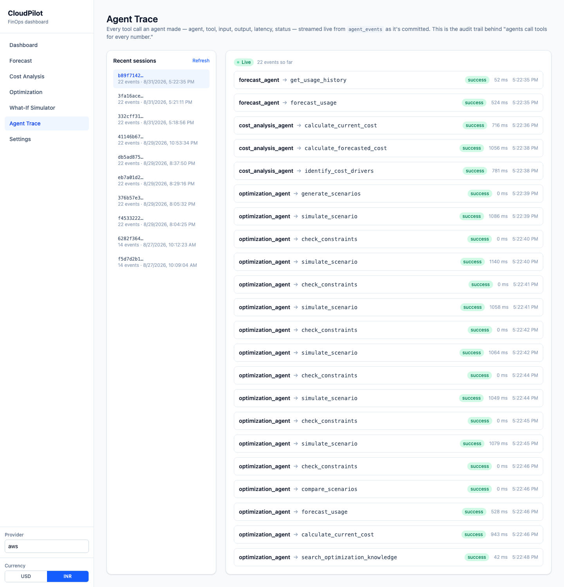

# CloudPilot

Agentic cloud cost forecasting and optimization platform — ML forecasts usage, a
pricing engine prices it, an OR-Tools solver optimizes it, and an LLM agent layer plans,
critiques, and explains the result in plain language, without ever touching a number
itself.

## Overview

CloudPilot ingests cloud usage/billing data and turns it into a forecast, a priced
bill, and a validated cost-optimization recommendation. It is **recommendation-only**:
nothing in the system calls a real cloud provider's API to provision, resize, or delete
anything. Every number surfaced anywhere in the app — in a chart, an API response, or an
agent's narrative — is produced by a deterministic model, a pricing calculation, or a
constraint solver; the Gemini-backed agent layer only plans which steps to run, reviews
a candidate for trustworthiness, and writes the explanation, all over data it is handed
rather than data it invents.

## Architecture



The one rule the codebase is organized around: **ML models forecast, the pricing engine
prices, OR-Tools optimizes, and LLM agents only plan/narrate/critique — never compute a
number.** Full diagram and rationale in [`docs/architecture.md`](docs/architecture.md);
the agent pipeline's node-by-node behavior is in
[`docs/agent-workflow.md`](docs/agent-workflow.md).

## Key features

- **Synthetic data generator** for a realistic multi-service usage dataset (seasonality,
  growth, idle periods, spikes, anomalies), plus CSV/JSON ingestion with per-row
  validation.
- **Pricing engine** with versioned, tiered rate data — on-demand, reserved, and
  autoscaling-aware billing, extensible to new providers without touching calculation
  logic.
- **ML forecasting** (XGBoost vs. a seasonal-naive baseline, selected by held-out RMSE)
  with confidence intervals and backfilled actual-vs-predicted accuracy tracking.
- **OR-Tools optimization** across 6 scenarios per resource (current, autoscaling,
  reserved, right-sizing, storage optimization, combined), each independently
  constraint-checked against latency/availability/budget targets.
- **LangGraph multi-agent pipeline** (planner → forecast → cost analysis → optimization
  ↔ critic → report) backed by Gemini, with a deterministic critic that can reject a
  recommendation and force a bounded retry, and RAG-cited explanations from a real
  FinOps knowledge base.
- **Full audit trail** — every tool call any agent makes is logged and streamed live via
  Server-Sent Events to the Agent Trace view.
- **USD/INR display toggle** — currency conversion is enforced as presentation-only,
  mechanically verified never to influence a calculation.
- **231 backend tests, 97% line coverage**, run against a real Postgres with no mocked
  data layer.

## Tech stack

| Layer | Technology |
|---|---|
| Frontend | React 19 + TypeScript + Vite + Tailwind CSS + Recharts |
| Backend | FastAPI + Pydantic + SQLAlchemy + Alembic |
| Database | PostgreSQL |
| Forecasting | XGBoost, scikit-learn, pandas/NumPy |
| Optimization | Google OR-Tools (CP-SAT) |
| Agents | LangGraph + Google Gemini API (`gemini-2.5-flash`, hosted — no local inference) |
| RAG | FAISS + `sentence-transformers` (local embeddings) |
| Infra | Docker Compose |
| Testing | Pytest, `pytest-cov` |

## Screenshots

| | |
|---|---|
|  |  |
| **Dashboard** — current, predicted, and optimized cost at a glance. | **Forecast** — history, forecast, and confidence interval per usage type. |
|  |  |
| **Cost Analysis** — breakdown by SKU and ranked cost drivers. | **Optimization** — set budget/latency/availability constraints. |
|  |  |
| **Optimization result** — live agent progress, chosen plan, critic verdict, RAG-cited explanation. | **Scenario comparison** — all 6 scenarios ranked by cost, savings, and risk. |
|  |  |
| **What-If Simulator** — re-run the solver against different constraints. | **Agent Trace** — live, per-tool-call audit log for any session. |

All screenshots were captured against a running instance with the bundled synthetic
dataset loaded (see [Usage walkthrough](#usage-walkthrough)). To regenerate them
yourself, drive the app with Playwright (or your browser of choice) through the same
flow: select a resource, run a forecast, run cost analysis, run an optimization, and
open its agent trace.

## Setup

### Prerequisites

| Tool | Version |
|---|---|
| Docker + Docker Compose | Recent Docker Desktop, or Engine + Compose plugin |
| Python | 3.12 (for local, non-Docker backend development) |
| Node.js | 20+ (LTS) |

### 1. Environment variables

CloudPilot uses **two `.env` files** — one at the repo root (read by `docker compose`),
one inside `backend/` (read by the backend when run directly, since Pydantic Settings
loads `.env` relative to the process's working directory):

```bash
cp .env.example .env
cp .env.example backend/.env
cp frontend/.env.example frontend/.env
```

Key variables (see [`.env.example`](.env.example) for the full list):

| Variable | Purpose |
|---|---|
| `GEMINI_API_KEY` | Google Gemini API key. Optional — every agent falls back to a deterministic template narrative without one; no computed number depends on it. |
| `GEMINI_MODEL` | Defaults to `gemini-2.5-flash`. |
| `DATABASE_URL` | Postgres connection string. Docker Compose sets this automatically for the containerized backend; edit it in `backend/.env` if running the backend on your host. |
| `USD_TO_INR_RATE` | Display-only currency conversion rate (default `83.0`). Never used in any calculation. |

### 2. Start Postgres + backend

```bash
docker compose up --build
```

This builds the backend image, starts Postgres, and runs
`alembic upgrade head && uvicorn app.main:app` automatically — migrations are applied on
every start.

```bash
curl http://localhost:8000/api/health   # {"status":"ok"}
```

### 3. Seed reference pricing data

```bash
docker compose exec backend python -m app.pricing.seed_data
```

### 4. Start the frontend

```bash
cd frontend
npm install
npm run dev
```

Full step-by-step setup — including the exact provider/pricing pitfall to avoid when
loading sample data, running the backend without Docker, and diagnosing a
misconfigured environment — is in
[`docs/running-locally.md`](docs/running-locally.md).

## Usage walkthrough

The full sequence from raw data to a validated recommendation:

1. **Upload data** — generate the synthetic dataset and load it:
   ```bash
   docker compose exec backend python -m app.services.synthetic_data --days 120 --format csv
   docker compose cp backend:/datasets/synthetic_usage.csv ./datasets/synthetic_usage.csv
   curl -F "file=@datasets/synthetic_usage.csv;type=text/csv" http://localhost:8000/api/data/upload
   ```
2. **Forecast** — Forecast page → pick a resource, usage type, and horizon → **Generate
   forecast**.
3. **Optimize** — Optimization page → set budget/latency/availability constraints →
   **Optimize**. This runs the full agent pipeline: forecast → cost analysis → scenario
   simulation → critic validation → report.
4. **View the result** — the resulting plan, savings, critic verdict, RAG-cited
   explanation, and full scenario comparison table are shown immediately; the same run
   is browsable afterward on the Agent Trace page.

The exact API calls behind each step (for scripting or verification) are in
[`docs/running-locally.md` §8](docs/running-locally.md#8-the-exact-sequence-raw-data--validated-critic-approved-optimization).

## API reference

All endpoints are prefixed with `/api`. A representative subset:

| Method & path | Purpose |
|---|---|
| `POST /data/upload` | Upload and validate a usage CSV/JSON file |
| `POST /forecast` | Run the forecasting pipeline for one resource/usage type |
| `POST /cost/predict` | Forecast + price the next billing period |
| `POST /optimization/run` | Run all 6 scenarios through the solver (no LLM) |
| `POST /agent/run` | SSE — full agent pipeline with critic validation |
| `GET /agent-trace/{session_id}` | SSE — live tool-call audit trail for one session |
| `GET /settings` | System status: Gemini configured?, DB connected?, current FX rate |

Full endpoint list, request/response shapes, and notes on the two optimization paths:
[`docs/api-reference.md`](docs/api-reference.md).

## Running tests

```bash
docker compose up -d postgres
cd backend
python3 -m venv .venv && source .venv/bin/activate
pip install -r requirements.txt
alembic upgrade head
python -m app.pricing.seed_data
pytest
```

231 tests, 97% line coverage, no `GEMINI_API_KEY` required — every LLM-touching test
either mocks Gemini directly or verifies the deterministic fallback path. For coverage
output: `pip install pytest-cov && pytest -q --cov=app --cov-report=term-missing`.
Details on what's tested and what isn't: [`docs/definition-of-done.md`](docs/definition-of-done.md).

## Project structure

```
cloudpilot/
├── frontend/                  React + TS + Vite + Tailwind + Recharts app
│   └── src/
│       ├── api/                API client + generated types
│       ├── components/         Shared UI (layout, resource selector, scenario table)
│       ├── context/             App-wide state (provider, resource, currency)
│       ├── hooks/                Data-fetching + SSE-streaming hooks
│       ├── lib/                    Pure helper functions (currency formatting, etc.)
│       └── pages/                  One file per route
├── backend/
│   ├── app/
│   │   ├── agents/              LangGraph agents (plan/reason/explain only)
│   │   ├── tools/                 Agent-callable, typed & logged tool wrappers
│   │   ├── forecasting/            ML forecasting models
│   │   ├── optimization/            OR-Tools optimization models
│   │   ├── pricing/                  Pricing engine
│   │   ├── rag/                       FAISS + local-embedding retrieval
│   │   ├── api/                         FastAPI routers
│   │   ├── models/                       SQLAlchemy ORM models
│   │   ├── services/                      Cross-cutting business logic
│   │   ├── evaluation/                     Scaffolded, unused — see docs/definition-of-done.md
│   │   └── config/                          Pydantic settings
│   ├── alembic/                 Database migrations
│   └── tests/                     Pytest suite (231 tests)
├── datasets/                   Sample/reference datasets
├── benchmark/                  Scaffolded, unused — see docs/definition-of-done.md
├── docs/
│   ├── architecture.md          System diagram + tool-layer rationale
│   ├── agent-workflow.md         LangGraph pipeline, node by node
│   ├── technical-reference.md     Per-module implementation notes
│   ├── api-reference.md            Full endpoint reference
│   ├── running-locally.md           Exhaustive setup walkthrough + pitfalls
│   ├── definition-of-done.md         Rule-by-rule audit against project requirements
│   └── screenshots/                   README screenshots
├── docker-compose.yml
└── .env.example
```

## License

This project is licensed under the MIT License. See the `LICENSE` file for more details.
