# Agent workflow

The LangGraph pipeline behind `POST /api/agent/run`, built in `app/agents/graph.py`.
Every node either calls a typed tool (`app/tools/`) for its numbers or asks Gemini to
narrate/plan/critique already-computed data — never both.

## Flow diagram

This matches `_route_after_optimization` and the graph's conditional edges exactly,
including the three branches most tests never exercise by default (a `Plan` that skips
a step, and the critic reject → retry cycle):

```mermaid
flowchart TD
    Start(["POST /api/agent/run"]) --> Planner

    Planner["**Planner**\nGemini classifies the request into\na typed Plan: run_forecast / run_cost_analysis\n/ run_optimization (all default true)"]

    Planner --> ForecastGate{"plan.run_forecast?"}
    ForecastGate -->|"no"| CostGate
    ForecastGate -->|"yes"| ForecastAgent["**Forecast agent**\ncalls get_usage_history + forecast_usage\nGemini narrates the forecast JSON verbatim"]
    ForecastAgent --> CostGate{"plan.run_cost_analysis?"}

    CostGate -->|"no"| OptGate
    CostGate -->|"yes"| CostAgent["**Cost Analysis agent**\ncalls calculate_current_cost,\ncalculate_forecasted_cost, identify_cost_drivers\nGemini narrates the breakdown"]
    CostAgent --> OptGate{"plan.run_optimization?"}

    OptGate -->|"no"| Report
    OptGate -->|"yes, first pass"| SimulateAll["**Optimization agent** — first pass only\ngenerate_scenarios -> simulate_scenario x6\n-> check_constraints x6 -> compare_scenarios\n(solver runs ONCE; cached in graph state)"]

    SimulateAll --> ProposeCandidate["propose cheapest-ranked\nnot-yet-rejected candidate"]
    ProposeCandidate --> HasCandidate{"a candidate\nremains?"}

    HasCandidate -->|"no — all rejected\nor none feasible"| Finalize["finalize_optimization\nreport honestly: no scenario passed"]
    Finalize --> Report

    HasCandidate -->|"yes"| Critic["**Critic**\ndeterministic re-check: capacity, latency,\navailability, budget, cost-reduction sanity,\nforecast-uncertainty ratio\n+ one Gemini summary sentence"]

    Critic --> Verdict{"approved?"}
    Verdict -->|"yes"| Approved["mark approved,\ncache RAG-cited narrative"]
    Approved --> Report

    Verdict -->|"no, attempts < 3"| ProposeCandidate
    Verdict -->|"no, attempts == 3"| Finalize

    Report["**Report agent**\ncombines all narratives into one report\n(Forecast / Cost Analysis / Optimization / Reviewer Note)\nadds no new numbers"]
    Report --> End(["SSE stream closes;\nfinal_report + full state returned"])
```

## The optimization ↔ critic cycle, precisely

This is the one genuine cycle in the graph — everything else is a straight line. Two
details that are easy to get wrong when re-implementing this from memory:

- **The solver runs exactly once per session**, not once per retry. All 6 scenarios are
  simulated and ranked on the first pass into `optimization_results_by_type` /
  `optimization_ranked` (graph state). A critic rejection routes back to
  `optimization`, but that node just proposes the *next* already-computed candidate
  from the cached ranking (`pick_next_candidate`) — it never re-invokes
  `simulate_scenario` or the OR-Tools solver again.
- **Bounded to `MAX_CRITIC_ATTEMPTS = 3`** (`app/agents/optimization_agent.py`). If the
  3rd candidate is also rejected, `finalize_optimization` runs and the final report
  states plainly that no scenario passed validation, quoting the last real rejection
  reason — it does not fall back to presenting a rejected scenario as approved.

## Tool calls per node

| Node | Tools called | Gemini used for |
|---|---|---|
| Planner | — | Classifying intent into `Plan` (structured JSON mode) |
| Forecast | `get_usage_history`, `forecast_usage` | Narrating the forecast |
| Cost Analysis | `calculate_current_cost`, `calculate_forecasted_cost`, `identify_cost_drivers` | Narrating the breakdown |
| Optimization | `generate_scenarios`, `simulate_scenario` (×6), `check_constraints` (×6), `compare_scenarios`, `search_optimization_knowledge` | Narrating the candidate + citing RAG sources |
| Critic | — (see note) | One summary sentence over already-computed verdicts |
| Report | — | Combining prior narratives (no new numbers) |

**Correction:** the Critic calls no tools at all — `app/agents/critic.py`'s own
docstring says so explicitly ("the critic computes nothing new and calls no tools").
It re-verifies the *already-fetched* `ConstraintCheck` list the Optimization node got
from its one `check_constraints` call (state key `optimization_checks_by_type`), rather
than calling the tool a second time. A consequence worth knowing when scripting against
the API: the critic's `approved`/`rejection_reason` verdict is a LangGraph state field,
not a tool call, so it **never appears in `agent_events`** — the only way to observe it
is the SSE stream's `finalize_optimization` chunk (`optimization_data.approved`) or the
final report text, both covered in `docs/running-locally.md`.

Every cell in the "Tools called" column logs to `agent_events` via
`app/tools/base.py::run_tool()` — that table is what `GET /api/agent-trace/{session_id}`
streams live, and what the Agent Trace page renders.

## Graceful degradation without a Gemini key

If `GEMINI_API_KEY` is unset, or every retry to Gemini is exhausted
(`app/agents/llm_client.py`, exponential backoff up to 4 attempts on 429/500/502/503/504),
every node above falls back to a deterministic template that states the same
already-computed numbers in plain text instead of LLM prose. The pipeline was verified
end-to-end this way (no mocking, real Postgres, real dataset) precisely because no real
Gemini key has been available in this project's environment — see the README's
"Known gaps" section.
