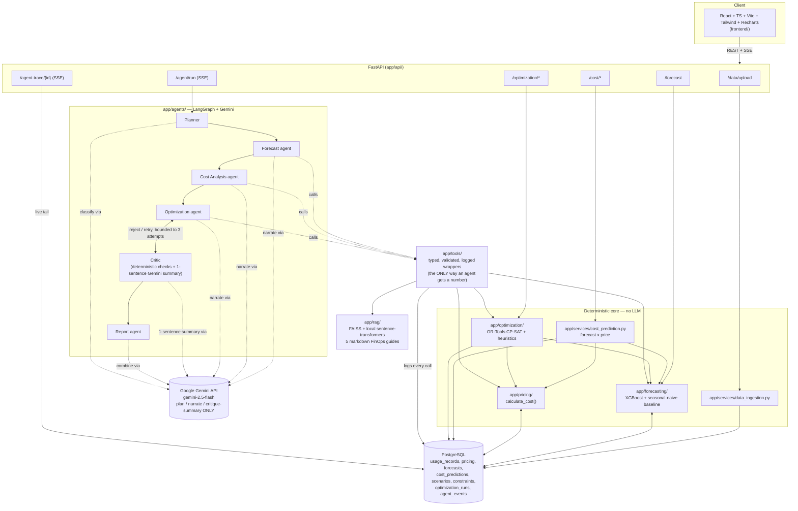

# Architecture

CloudPilot is recommendation-only: every arrow below either reads stored data or writes
a recommendation back to Postgres. Nothing in this system calls a real cloud provider's
API to provision, resize, or delete anything.

## Table of contents

- [Layer responsibilities](#layer-responsibilities)
- [System diagram](#system-diagram)
- [Why the tool layer exists](#why-the-tool-layer-exists)
- [Why the deterministic core has no LLM](#why-the-deterministic-core-has-no-llm)

## Layer responsibilities

The one non-negotiable rule the whole codebase is organized around:

| Layer | Package | Computes |
|---|---|---|
| ML models | `app/forecasting/` (XGBoost + seasonal-naive baseline) | Future usage |
| Pricing engine | `app/pricing/` | Cost, from usage × versioned rate data |
| Solver | `app/optimization/` (OR-Tools CP-SAT + documented heuristics) | Resource allocation under constraints |
| LLM agents | `app/agents/` (LangGraph + Gemini) | **Nothing numeric** — plan, narrate, critique |

Every number an agent's narrative mentions was produced by one of the top three rows
and handed to Gemini as already-computed JSON; the system instructions in
`app/agents/*.py` explicitly forbid the model from computing or inventing a number of
its own (see [`definition-of-done.md`](definition-of-done.md) for how this is verified
today, and its limits).

## System diagram

## Why the tool layer exists

`app/tools/` (Phase 7) is the enforcement mechanism for "agents never compute numbers,"
not just documentation of it. Every tool:

1. Takes typed, validated Pydantic input.
2. Calls straight into the deterministic core (forecasting/pricing/optimization/RAG) —
   never an LLM.
3. Is wrapped by `app/tools/base.py::run_tool()`, which logs agent name, tool name,
   input, output, latency, and status to `agent_events` — success or failure — before
   returning or raising.

An agent node can *only* obtain a number by calling one of these tools; there is no
other path from an agent node to a number in the codebase. That's what makes the
`agent_events` table a genuine audit trail rather than a best-effort log: any number in
a final report is traceable to exactly one logged tool call.

## Why the deterministic core has no LLM

Forecasting, pricing, and optimization are pure Python/NumPy/XGBoost/OR-Tools —
independently testable and independently correct without ever importing
`app/agents/llm_client.py`. This is why the test suite runs to completion (231 tests,
97% coverage) with no `GEMINI_API_KEY` configured at all: every deterministic
computation is verified for real, and every LLM-touching code path is verified via its
documented fallback behavior (see [`definition-of-done.md`](definition-of-done.md)).
